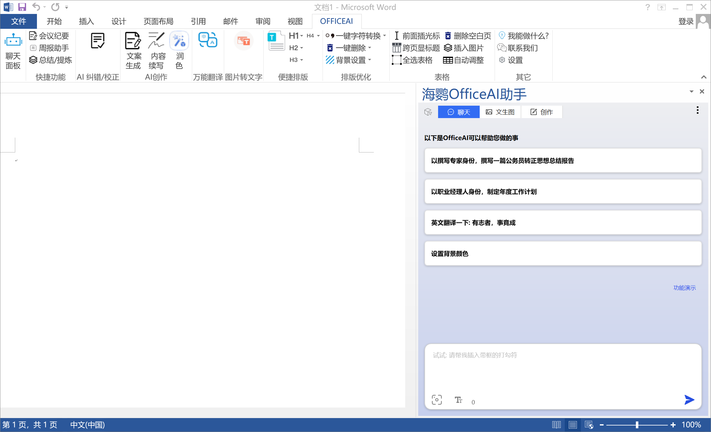
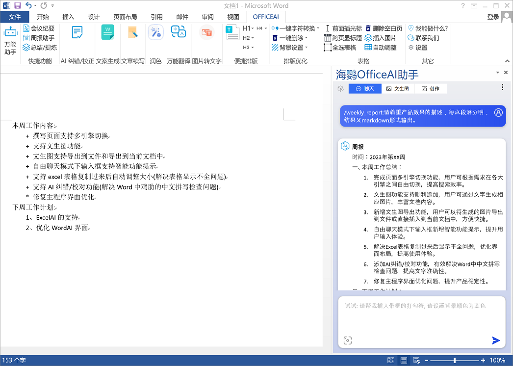
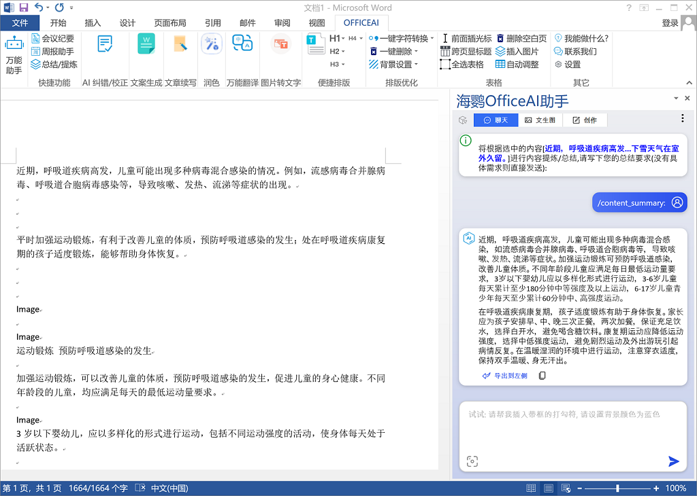
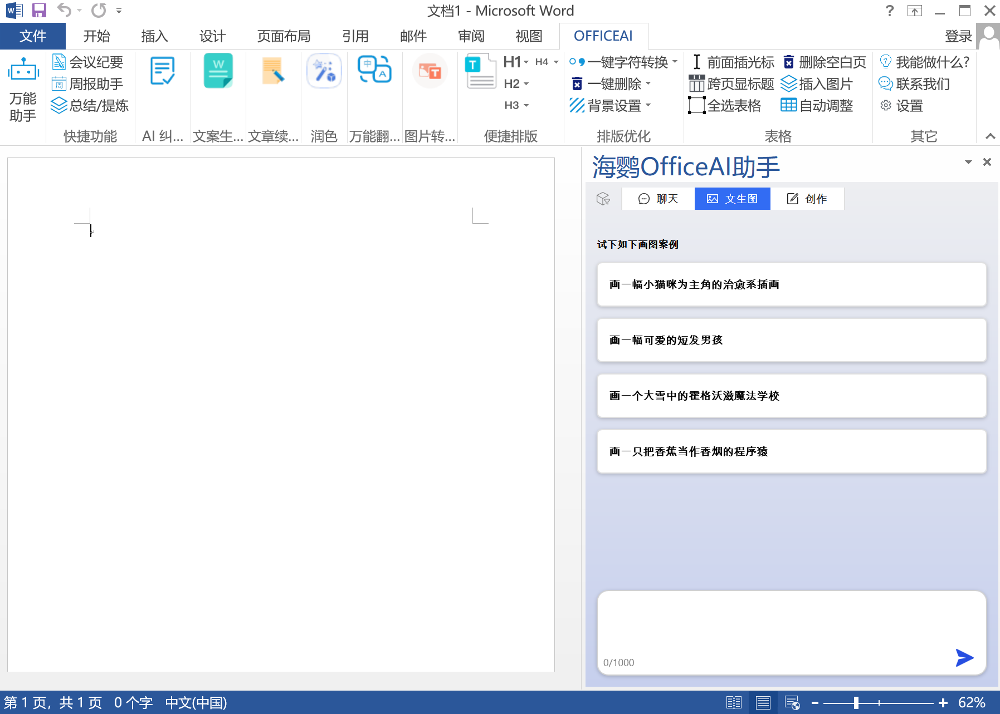
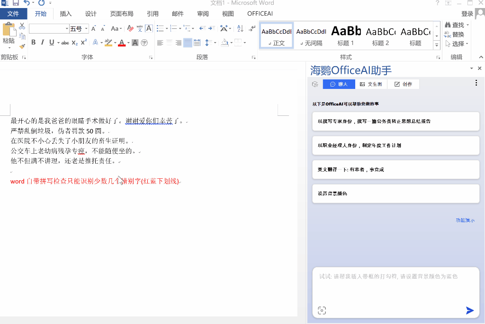
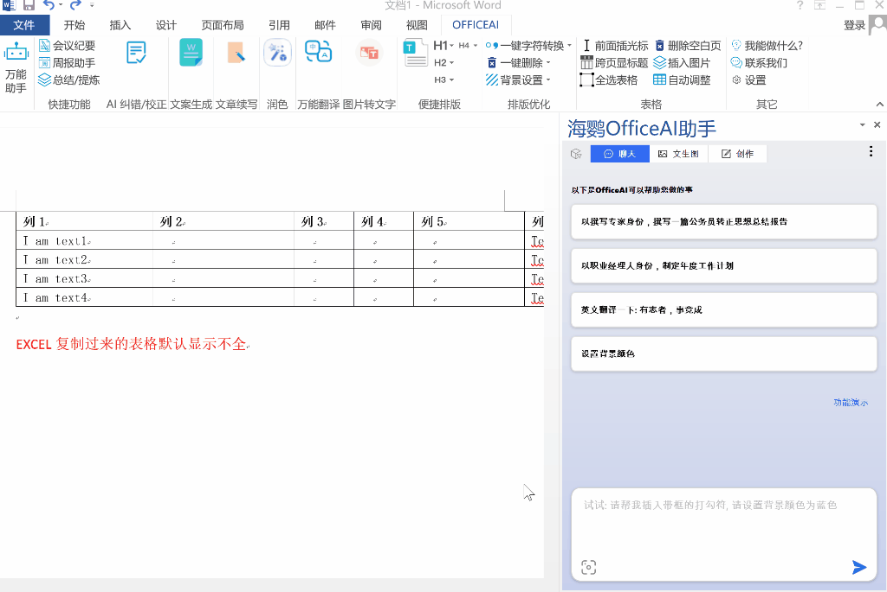
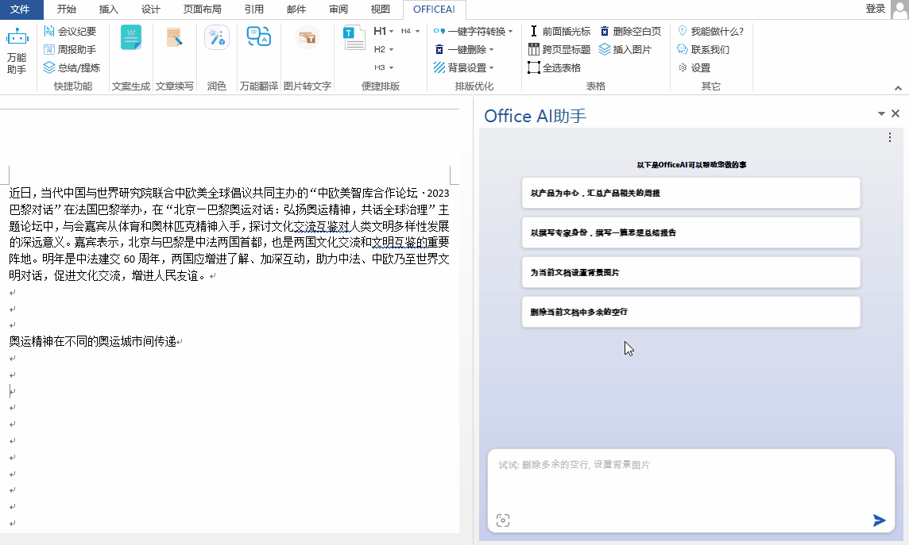
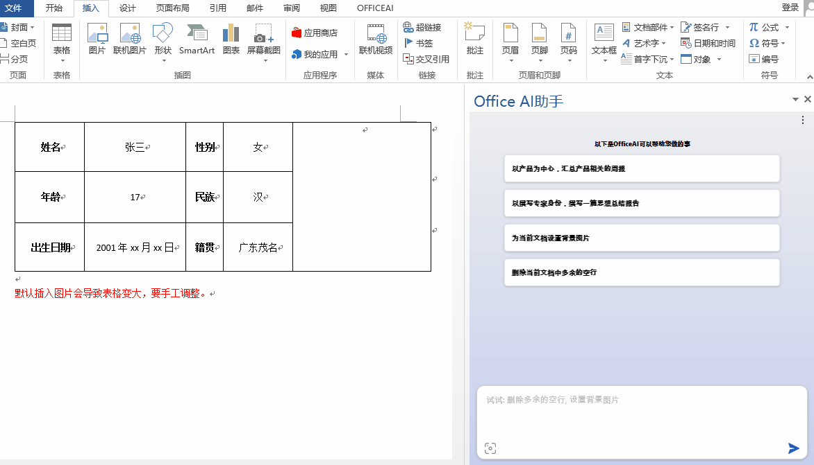
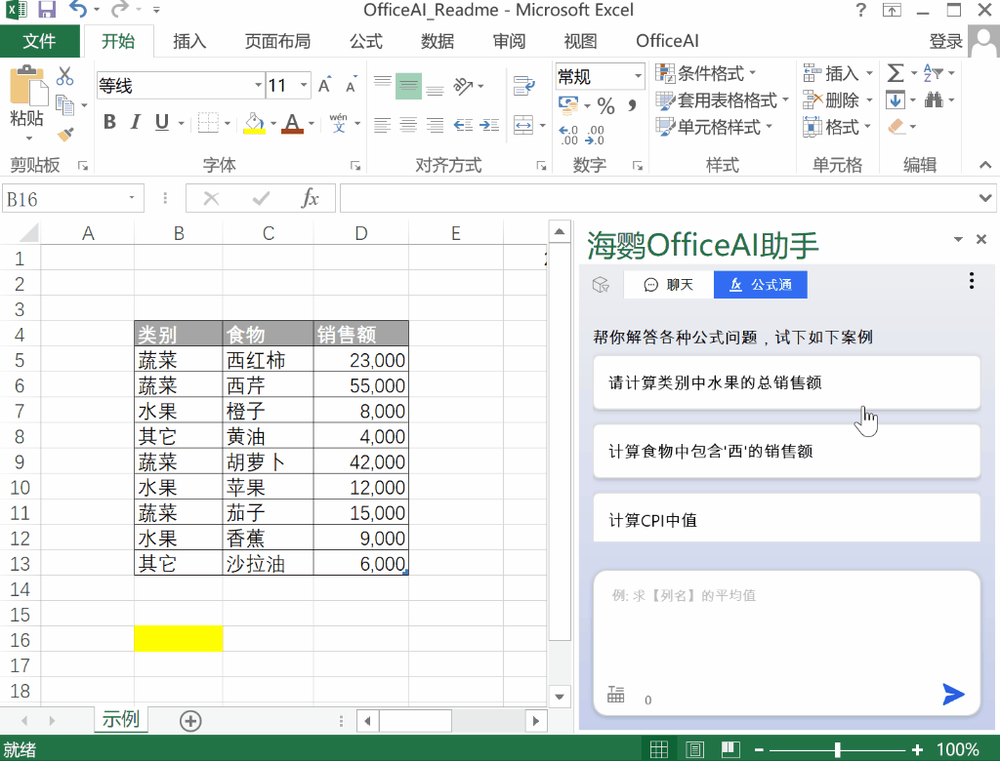
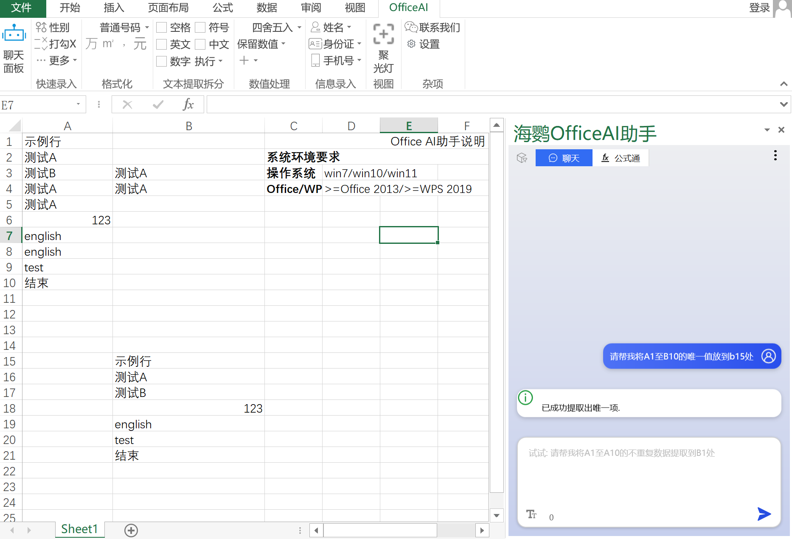

# OfficeAI

[English](/README_en.md) | [中文](/README_zh.md) 


[](https://github.com/office-sec/OfficeAI/releases)  [](https://www.office-ai.cn) [](images/contactQQ.png)  [](images/contactWX.png)

# OfficeAI Assistant Introduction

## Function Overview
OfficeAI Assistant is an AI-powered office tool designed specifically for Microsoft Office and WPS users. Whether you're trying to insert a checkmark (√), wondering how to add text before inserting a table, or figuring out which formula to use, this AI office assistant offers quick and accurate solutions. With simple commands, the ExcelAI plugin can automatically handle complex formula calculations and function selection. Meanwhile, the WordAI plugin is packed with features like organizing weekly reports, drafting meeting minutes, summarizing content, and refining documents. In short, OfficeAI Assistant will greatly enhance your productivity, making everyday tasks easier and more efficient.

WordAI UI



ExcelAI UI


## Installation Requirements
Windows 7/10/11 or later + Office 2013/2016/2019/Office 365

# AI Authoring

It can lend a hand in various types of document creation, whether it's marketing, technical documentation, or internal communication. AI can enhance document quality based on personalized requirements, ensuring that each document meets your expected standards.


## Document Generation
Capable of creating various types of articles. Whether you need to write marketing copy, technical documentation, or internal communication content, this plugin can handle it effortlessly.

## Work Summarization
Through intelligent means, it quickly consolidates your work achievements and data, generating structured weekly reports that allow you to easily understand work progress and share it with relevant teams or leaders. This function greatly simplifies the process of report production, saving you valuable time and effort.


## Document Proofreading
Improves and optimizes articles according to your needs and preferences to enhance their quality. Whether it's language expression, logical coherence, or content fluency, the AI assistant can adjust the document according to your guidance, ensuring that the final output meets your expectations and style, guaranteeing higher quality manuscripts.

## Minutes Generation
Automatically extracts important information from documents, intelligently identifies and extracts key content from documents, then generates structured meeting minutes. This function greatly simplifies the process of writing meeting minutes, helping you quickly capture the key points of the meeting and organize them into a format that is easy to read and share, making your meeting minutes clearer and more accurate.


## Content Extension
Through AI technology, it understands the context of the text and provides you with new ideas, supplementary materials, or deeper insights when you need to further develop content, enriching document content. This feature makes manuscript writing more efficient and comprehensive, helping you expand and improve content more quickly.

## Language Translation
Supports translation between dozens of languages, including but not limited to English, Chinese, Japanese, Korean, and French. Whether you need to translate text into other languages or translate other languages into the language you need, this plugin can provide fast and accurate translation services. This feature provides a convenient solution for cross-language communication, helping you handle multilingual texts more easily.

## Intelligent Interaction
You can interact with the assistant through interactive dialogue, ask questions about document processing, seek help or advice, and obtain information on specific topics or answers to questions. This intelligent interaction method allows you to obtain the information you need more conveniently, quickly solve problems, and complete document processing tasks.

## Writing Suggestions
Whether it's copywriting, content creation, or creative expression, the assistant can provide targeted suggestions and tips through intelligent analysis and recommendations. This feature can help improve the quality of documents, enhance content attractiveness, and even inspire creative ideas, making you more effective in writing and creativity.

## Image to Text
Recognizes text in images and outputs it to a Word document. With this feature, you can import images containing text into documents, and the assistant will automatically recognize the text content in the image and accurately convert it into editable text, making it convenient for you to further edit or use in Word.

# AI Illustrations

Generate corresponding images by describing them in text within Office, eliminating the hassle of searching for images online.


## Example
Keywords:

    Create a healing illustration with a kitten as the main character.
    Main elements: kitten, yarn ball
    Background: minimalist, clean
    Requirements: warm colors, cute style.

Result after generation:


# Word Features

Easily accomplish various functions in Word through interaction with AI, without the need to search for specific function locations or memorize complex VBA macro codes. This interactive operation provides users with a more intuitive and user-friendly interface, making it more convenient and efficient to complete tasks. Whether for beginners or experienced users, this intelligent usage experience makes document editing more enjoyable and efficient, saving a lot of time and effort.

## Insert Special Symbols
No need to manually search for symbols like checkmarks, pentagrams, or circled numbers from the menu.


## AI Proofreading/Correction
Current mainstream input methods provide predictive input, resulting in occasional typos in Word. The built-in spell check in Word is somewhat ineffective for Chinese. AI proofreading provides much better results!


## Automatic Table Adjustment
Easily solve the problem of incomplete display of table contents copied from Excel.


## One-click Punctuation Replacement
Quickly replace English punctuation (e.g., ',.<>') with Chinese punctuation (e.g., '，。《》'). This makes the text more standardized and unified across different contexts, improving the overall quality and readability of the document.

## Remove Blank Lines Throughout the Document
Quickly remove large sections of blank lines in documents, making the document format clearer and more tidy. This feature allows you to remove unnecessary blank lines with one click, saving time and ensuring a more standardized format for the document.


## Set Background Color
Set a specified background color for the current document. With this feature, you can choose the desired color and apply it to the background of the entire document. This operation can make the document more personalized and visually appealing, making it stand out and easy to distinguish.

## Set Background Image
Quickly set a background image for the document to improve work efficiency.

## Select Entire Table
Resolved the issue of incomplete selection when manually selecting tables in Word documents. With this feature, you can efficiently select the desired table content, avoiding incomplete selection that may occur with manual operations, improving work efficiency, and ensuring the accuracy of the entire table selection.

## Insert Non-deforming Images into Cells
Insert images into cells that adapt to the size of the cells, solving the problem of tables being stretched every time an image is inserted, affecting appearance.


## Add Table Headers Across Pages
Add titles to tables on each page. This operation allows each table page to clearly present title information, making the document more structured and readable, facilitating user reading and understanding of multi-page table content. This feature greatly enhances the overall organization and visualization of the document, making the table clear and understandable when displayed on multiple pages.

## Delete Blank Pages
Easily remove extra blank pages caused by table formatting, keeping the document format clean, improving document readability, and avoiding printing extra blank pages.

## Input Before Tables
Insert characters before tables, effectively solving the problem of not being able to directly add titles or descriptions before tables. This feature allows users to insert text before tables, such as titles or descriptions, to provide clearer context for table content, enhancing document readability and structure. This operation simplifies the editing of content around tables, making it easier for users to manage table formatting and structure in documents.

## Remove Header Horizontal Lines
Quickly remove horizontal lines in headers. This operation allows users to easily remove unnecessary horizontal lines in headers, improving the overall appearance and professionalism of the document. This convenient editing feature saves users time, making the page layout clearer and tidier, ensuring the aesthetic and consistency of the document's appearance.

## Generate Tables
Insert tables with specified rows and columns. For example:
"Please insert a table with 5 rows and 3 columns."

## Undo Last Operation
You can undo the last word operation. For example:
"Please undo the last operation."

# Excel Features

## Formula Channel
Ask for the formula you want through AI and directly apply it to Excel.


**Formula Channel** provides three ways to generate formulas directly:
1. Natural language dialogue:
``` 
Calculate the total sales of vegetables in the category, and place the result in F2.
```

2. With column titles:
``` 
Calculate the total sales of "fruit" in the category.
```

3. Direct cell range:
```
Calculate the average of C2:C6.
```

Formulas can also be generated in the **Chat** page using column names and cell references:
* With column titles:
```
Calculate the total sales of "fruit" in the category.
```
* Cell range method:
```
Calculate the average of C2:C6.
```

## Batch Insert Pictures
Batch insert pictures, align them with cells, and keep the picture sizes consistent. Example:
```
Please insert pictures, place them in cell B1, and meet the following requirements:
Initial picture size: cell size
Picture adapts to cell: yes
Show comments: yes
Comment display position: left
```

## One-click Cell Size Setting
Directly adjust the column width and row height of cells at once, without the need for manual adjustments. Example:
```
Set the height of the selected cells to 50 and the width to 25.
```

## Extract Unique Data
Extract unique data from one or more columns of data and place them in new cells. Example:
```
Please extract unique data from A1 to B10 and place them in cell C1.
```


## Sum, Average, Maximum, Minimum
Perform statistical operations such as sum, average, maximum, minimum, etc., on cells. Example:
```
Calculate the sum of the data in A1:A10 and place the result in cell C1.
```

## Quick Data Formatting
Quickly set data to common formats, such as displaying in units of ten thousand, showing currency symbols, displaying Chinese numerals, etc.


