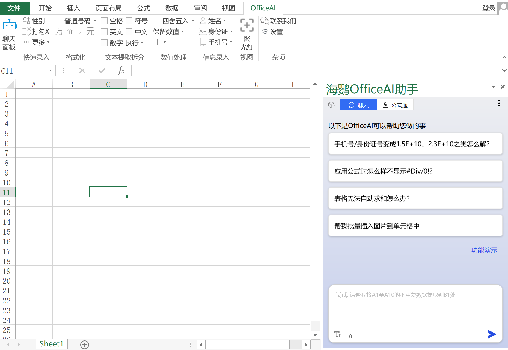

# OfficeAI

[English](/README_en.md) | [中文](/README_zh.md) 


[](https://github.com/office-sec/OfficeAI/releases)  [](https://www.office-ai.cn) [](images/contactQQ.png)  [](images/contactWX.png)

# OfficeAI Assistant Introduction

## Function Overview
The OfficeAI Assistant is an AI plugin for Microsoft Office/WPS, designed to help with questions like "How do I input a checkmark (√) symbol?", "How do I add text before inserting a table?", or "Which formula should I use?" It can tackle complex issues you're unsure about. Just tell the assistant what you need or what calculations you want, and AI will automatically complete the corresponding function or formula for you. Additionally, the AI assistant features functions such as compiling weekly reports, meeting minutes, content summaries, and proofreading.

WordAI UI


ExcelAI UI



## Installation Requirements
Windows 7/10/11 or later + Office 2013/2016/2019/Office 365

# AI Authoring

It can lend a hand in various types of document creation, whether it's marketing, technical documentation, or internal communication. AI can enhance document quality based on personalized requirements, ensuring that each document meets your expected standards.


## Document Generation
Capable of creating various types of articles. Whether you need to write marketing copy, technical documentation, or internal communication content, this plugin can handle it effortlessly.

## Work Summarization
Through intelligent means, it quickly consolidates your work achievements and data, generating structured weekly reports that allow you to easily understand work progress and share it with relevant teams or leaders. This function greatly simplifies the process of report production, saving you valuable time and effort.


## Document Proofreading
Improves and optimizes articles according to your needs and preferences to enhance their quality. Whether it's language expression, logical coherence, or content fluency, the AI assistant can adjust the document according to your guidance, ensuring that the final output meets your expectations and style, guaranteeing higher quality manuscripts.

## Minutes Generation
Automatically extracts important information from documents, intelligently identifies and extracts key content from documents, then generates structured meeting minutes. This function greatly simplifies the process of writing meeting minutes, helping you quickly capture the key points of the meeting and organize them into a format that is easy to read and share, making your meeting minutes clearer and more accurate.


## Content Extension
Through AI technology, it understands the context of the text and provides you with new ideas, supplementary materials, or deeper insights when you need to further develop content, enriching document content. This feature makes manuscript writing more efficient and comprehensive, helping you expand and improve content more quickly.

## Language Translation
Supports translation between dozens of languages, including but not limited to English, Chinese, Japanese, Korean, and French. Whether you need to translate text into other languages or translate other languages into the language you need, this plugin can provide fast and accurate translation services. This feature provides a convenient solution for cross-language communication, helping you handle multilingual texts more easily.

## Intelligent Interaction
You can interact with the assistant through interactive dialogue, ask questions about document processing, seek help or advice, and obtain information on specific topics or answers to questions. This intelligent interaction method allows you to obtain the information you need more conveniently, quickly solve problems, and complete document processing tasks.

## Writing Suggestions
Whether it's copywriting, content creation, or creative expression, the assistant can provide targeted suggestions and tips through intelligent analysis and recommendations. This feature can help improve the quality of documents, enhance content attractiveness, and even inspire creative ideas, making you more effective in writing and creativity.

## Image to Text
Recognizes text in images and outputs it to a Word document. With this feature, you can import images containing text into documents, and the assistant will automatically recognize the text content in the image and accurately convert it into editable text, making it convenient for you to further edit or use in Word.

# AI Illustrations

Generate corresponding images by describing them in text within Office, eliminating the hassle of searching for images online.


## Example
Keywords:

    Create a healing illustration with a kitten as the main character.
    Main elements: kitten, yarn ball
    Background: minimalist, clean
    Requirements: warm colors, cute style.

Result after generation:


# Word Features

Easily accomplish various functions in Word through interaction with AI, without the need to search for specific function locations or memorize complex VBA macro codes. This interactive operation provides users with a more intuitive and user-friendly interface, making it more convenient and efficient to complete tasks. Whether for beginners or experienced users, this intelligent usage experience makes document editing more enjoyable and efficient, saving a lot of time and effort.

## Insert Special Symbols
No need to manually search for symbols like checkmarks, pentagrams, or circled numbers from the menu.


## AI Proofreading/Correction
Current mainstream input methods provide predictive input, resulting in occasional typos in Word. The built-in spell check in Word is somewhat ineffective for Chinese. AI proofreading provides much better results!


## Automatic Table Adjustment
Easily solve the problem of incomplete display of table contents copied from Excel.


## One-click Punctuation Replacement
Quickly replace English punctuation (e.g., ',.<>') with Chinese punctuation (e.g., '，。《》'). This makes the text more standardized and unified across different contexts, improving the overall quality and readability of the document.

## Remove Blank Lines Throughout the Document
Quickly remove large sections of blank lines in documents, making the document format clearer and more tidy. This feature allows you to remove unnecessary blank lines with one click, saving time and ensuring a more standardized format for the document.


## Set Background Color
Set a specified background color for the current document. With this feature, you can choose the desired color and apply it to the background of the entire document. This operation can make the document more personalized and visually appealing, making it stand out and easy to distinguish.

## Set Background Image
Quickly set a background image for the document to improve work efficiency.

## Select Entire Table
Resolved the issue of incomplete selection when manually selecting tables in Word documents. With this feature, you can efficiently select the desired table content, avoiding incomplete selection that may occur with manual operations, improving work efficiency, and ensuring the accuracy of the entire table selection.

## Insert Non-deforming Images into Cells
Insert images into cells that adapt to the size of the cells, solving the problem of tables being stretched every time an image is inserted, affecting appearance.


## Add Table Headers Across Pages
Add titles to tables on each page. This operation allows each table page to clearly present title information, making the document more structured and readable, facilitating user reading and understanding of multi-page table content. This feature greatly enhances the overall organization and visualization of the document, making the table clear and understandable when displayed on multiple pages.

## Delete Blank Pages
Easily remove extra blank pages caused by table formatting, keeping the document format clean, improving document readability, and avoiding printing extra blank pages.

## Input Before Tables
Insert characters before tables, effectively solving the problem of not being able to directly add titles or descriptions before tables. This feature allows users to insert text before tables, such as titles or descriptions, to provide clearer context for table content, enhancing document readability and structure. This operation simplifies the editing of content around tables, making it easier for users to manage table formatting and structure in documents.

## Remove Header Horizontal Lines
Quickly remove horizontal lines in headers. This operation allows users to easily remove unnecessary horizontal lines in headers, improving the overall appearance and professionalism of the document. This convenient editing feature saves users time, making the page layout clearer and tidier, ensuring the aesthetic and consistency of the document's appearance.

## Generate Tables
Insert tables with specified rows and columns. For example:
"Please insert a table with 5 rows and 3 columns."

## Undo Last Operation
You can undo the last word operation. For example:
"Please undo the last operation."

# Excel Features

## Formula Channel
Ask for the formula you want through AI and directly apply it to Excel.


**Formula Channel** provides three ways to generate formulas directly:
1. Natural language dialogue:
``` 
Calculate the total sales of vegetables in the category, and place the result in F2.
```

2. With column titles:
``` 
Calculate the total sales of "fruit" in the category.
```

3. Direct cell range:
```
Calculate the average of C2:C6.
```

Formulas can also be generated in the **Chat** page using column names and cell references:
* With column titles:
```
Calculate the total sales of "fruit" in the category.
```
* Cell range method:
```
Calculate the average of C2:C6.
```

## Batch Insert Pictures
Batch insert pictures, align them with cells, and keep the picture sizes consistent. Example:
```
Please insert pictures, place them in cell B1, and meet the following requirements:
Initial picture size: cell size
Picture adapts to cell: yes
Show comments: yes
Comment display position: left
```

## One-click Cell Size Setting
Directly adjust the column width and row height of cells at once, without the need for manual adjustments. Example:
```
Set the height of the selected cells to 50 and the width to 25.
```

## Extract Unique Data
Extract unique data from one or more columns of data and place them in new cells. Example:
```
Please extract unique data from A1 to B10 and place them in cell C1.
```


## Sum, Average, Maximum, Minimum
Perform statistical operations such as sum, average, maximum, minimum, etc., on cells. Example:
```
Calculate the sum of the data in A1:A10 and place the result in cell C1.
```

## Quick Data Formatting
Quickly set data to common formats, such as displaying in units of ten thousand, showing currency symbols, displaying Chinese numerals, etc.


# OfficeAI助手简介

## 功能简介
OfficeAI助手是Microsoft Office/WPS的AI插件，它帮解决"打勾（√）符号怎么输入?"、"怎么在插入表格前添加文字?"、"该用哪个公式“等，能太复杂不知道哪里找的问题。
你只需要告诉助手要做什么或算什么内容，AI自动帮您完成对应的功能或公式，同时AI助手具备周报整理、会议纪要，内容总结、润色等功能。

WordAI界面


ExcelAI界面


## 安装环境
win7/win10/win11或更高 + Office2013/Office2016/Office2019/Office 365

# AI创作
能够在多种文案类型中助您一臂之力，无论是市场营销、技术文档还是内部沟通，都能轻松应对。AI 能够根据个性化需求，有效提升文案质量，确保每篇文档都达到您的预期水准。


## 文案生成
具备创作多种类型的文章的能力。无论您需要编写市场营销文案、技术文档还是内部沟通内容，这款插件都能轻松胜任。

## 工作总结
通过智能化的方式，快速整合您的工作成果和数据，生成结构化的周报，让您轻松了解工作进展，并能够便捷地分享给相关团队或领导。这项功能大大简化了周报制作的流程，为您节省宝贵的时间和精力。


## 文章润色
根据您的需求和偏好，对文章进行改善和优化，以提升其质量。无论是在语言表达、逻辑连贯性还是内容流畅度方面，AI 助手能够根据您的指导进行调整，使得文章更符合您的期望和风格，确保最终产出的文稿质量更高。
## 纪要生成
自动提取文档重要信息的能力，能够智能地从文档中识别并提取关键内容，然后生成结构化的会议纪要。这项功能大大简化了会议纪要的撰写过程，帮助您快速捕捉会议中的要点，并将其整理成易于阅读和分享的格式，让您的会议纪要更加清晰、准确。


## 文章续写
通过 AI 技术，它能够理解文本的语境，并在您需要进一步发展内容时，为您提供新的想法、补充资料或更深层次的见解，从而丰富文档内容。这项功能使得文稿编写更为高效和全面，帮助您更快地完成内容的拓展和完善。
## 语言翻译
支持几十种语言之间的互译，包括但不限于英语、中文、日语、韩语和法语等。无论您需要将文本翻译成其他语言或将其他语言翻译成您需要的语言，这款插件都能够提供快速准确的翻译服务。这项功能为跨语言交流提供了便捷地解决方案，帮助您更轻松地处理多语言文本。
## 智能互动
您可以与助手进行交互式对话，询问有关文档处理的问题，寻求帮助或建议，获取特定主题的信息或解答疑惑。这种智能交互方式让您更便捷地获取所需信息，快速解决问题，并完成文档处理任务。
## 写作建议
无论是在文案写作、内容创作还是创意表达方面，助手可以通过智能分析和推荐，为您提供针对性的建议和提示。这项功能可以帮助您改善文案质量、提升内容吸引力，甚至激发创作灵感，让您在写作和创意方面更具成效。
## 图转文字
识别图片中的文字并将其输出到 Word 文档中。通过这项功能，您可以将包含文字的图片导入到文档中，助手会自动识别图片中的文字内容，并将其准确地转换成可编辑的文本，方便您在 Word 中进一步编辑或使用。

# AI插画

在Office用文字描述即可生成对应的图片，免去上网找图片的烦恼


## 示例
关键字

    画一幅小猫咪为主角的治愈系插画。
    主体：小猫、毛线球
    背景：极简、干净
    要求： 颜色温暖，画风可爱。

生成后效果如下:


# Word功能

通过与 AI 互动，轻松完成 Word 中的各项功能，无需费力搜索特定功能的位置，也不必记忆复杂的 VBA 宏代码。这种交互式操作为用户提供了更直观、更友好的界面，使得完成各项任务变得更加便捷和高效。无论是对于初学者还是经验丰富的用户，这种智能化的使用体验都让文档编辑更加愉快和高效，节省了大量的时间和精力。

## 插入特殊符号
不用手工的从菜单里一个个找要插入的带框打勾符、五角星或带圈数字等。


## AI纠错/校对
目前主流的输入法带联想输入，导致word中错别字时有发生，word中自带的拼写检查对中文的效果比较鸡肋，使用AI纠错效果倍好！


## 表格自动调整
轻松解决excel复制过来的表格内容显示不全的问题


## 标点一键替换
快速将文档中的英文标点符号（例如：',.<>'）替换为中文标点符号（例如：'，。《》'）。这使得文案在不同语境下更加规范和统一，提高了文档的整体质量和可读性。

## 删除全文空行
快速删除文档中产生的大段空行，使得文档格式更加清晰整洁。这项功能让您能够一键去除多余的空行，节省时间并确保文档呈现更为规范的格式。


## 设置背景颜色
为当前文档设置指定的背景颜色。通过这个功能，您可以选择所需的颜色，然后将其应用到整个文档的背景中。这样的操作能够使文档更具个性化和视觉吸引力，让您的文档更加突出和易于区分。
## 设置背景图片
快捷的给文档设置背景图片，以提升工作效率
## 全选表格
利用特定功能解决了在 Word 文档中全选表格时手动操作无法完全选中的问题。通过这一功能，您可以高效地全选所需表格内容，避免了手工操作可能出现的选择不完整的情况，提升了工作效率并确保了整个表格的选取准确性。

## 插入不变形图片
向表格当前单元格插入图片，适应单元格大小的图片，解决每次插入图片时导致表格拉大，影响外观的问题。


## 跨页添加表头
为每一页的表格添加标题。这一操作使得每个表格页面都能清晰地呈现标题信息，让文档更具结构性和可读性，方便用户阅读和理解多页表格内容。这项功能极大地提升了文档的整体组织和可视化效果，使得表格在分页显示时更为清晰明了。


## 删除空白页
轻松移除因表格排版而产生的多余空白页，保持文档排版整洁，提升文档可读性,同时避免多打印出空白的页
## 表格前输入
在表格前插入字符的功能，有效解决了无法直接在表格前添加标题或描述的问题。这项功能允许用户在表格前插入文字，比如标题或描述，为表格内容提供更清晰的上下文，增强文档可读性和结构性。这种操作简化了对表格周围内容的编辑，使得用户能够更轻松地管理文档中的表格排版和结构。
## 去除页眉横线
快速删除页眉中的横线。这项操作使用户能够轻松去除页眉中不需要的横线，提升文档整体外观和专业性。这种便捷的编辑功能节省了用户的时间，让页面布局更为清晰和整洁，确保了文档外观的美观性和一致性。
## 生成表格
插入指定行列的表格，案例:
```
请帮我插入一个5行3列的表格
```
## 撤消上一次操作
可以撤消最近一次的word操作，案例:
```
请帮我撤消上一次操作
```

# Excel功能

## 公式通
通过AI方式问出你想要的公式和直接用户到excel中


**公式通**中有3种方式直接生成公式：
1. 自然语言对话方式:
``` 
请计算一下类别中蔬菜的总销售额,结果放在F2处
```

2. 带标题名的方式:
``` 
求【类别】中"水果"的总【销售额】 
```

3. 直接单元格区域方式:
```
请统计C2:C6的平均值 
```

**聊天**页面中带列名和单元格方式生成公式:
* 带标题名的方式:
```
求【类别】中"水果"的总【销售额】 
```
* 单元格区域方式
```
请统计C2:C6的平均值 
```

## 批量插入图片
批量插入图片，让图片对齐单元格，并保持图片大小一致。案例:
```
    请帮我插入图片，放置到B1单元处，图片要求如下：
    图片初始大小：单元格大小
    图片自适应单元格：是
    是否显示批注: 是
    批注显示位置：左边
```

## 一键设置单元格大小
一次性直接调整单元格的列宽和行高，不用手工左右调整。案例:
```
将选中单元格高度设置为50, 宽度设置为25
```
## 提取不重复数据
将一列或多列数据中的不重复数据提取出来,放到新单元格中。案例:
```
请帮我将A1至B10中的唯一数据提取出来，放到C1单元格中。
```


## 求和、平均值、最大值、最小值
对单元格进行求和、平均值、最大值、最小值等统计操作。案例:
```
请帮我对A1:A10的数据算总和，结果放到C1单元格中。
```

## 快速格式化数据
可以快速的将数据设置为常用的数据类型，如：以万为单位、显示元、显示中文数字等等


# 其它

## 联系我们


