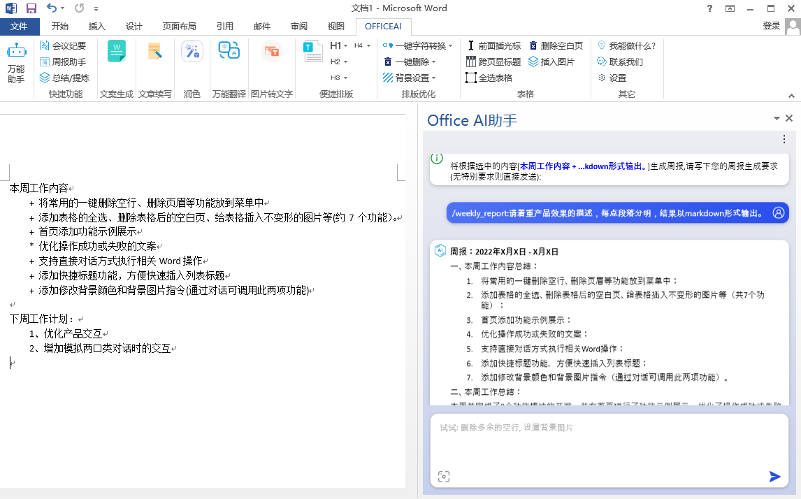
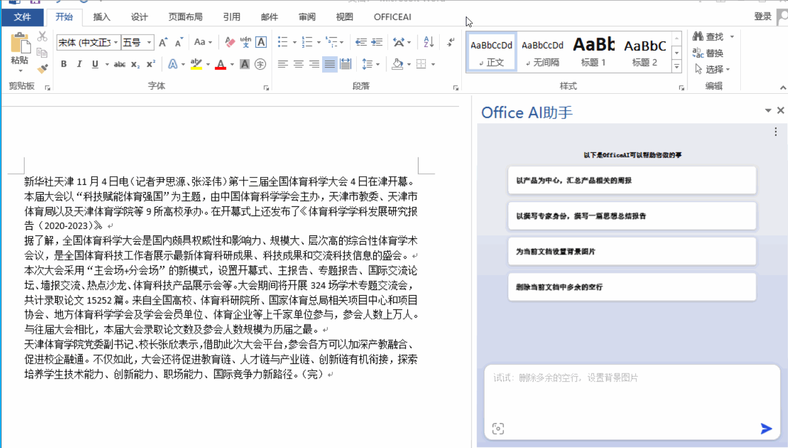
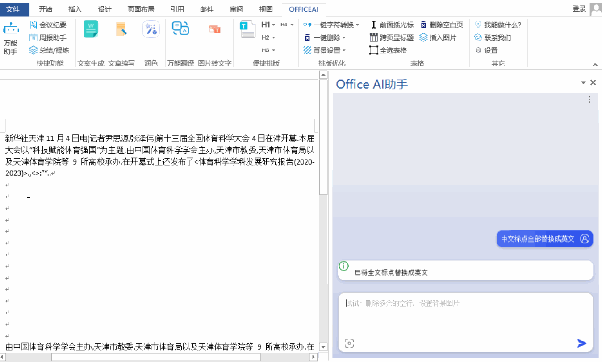
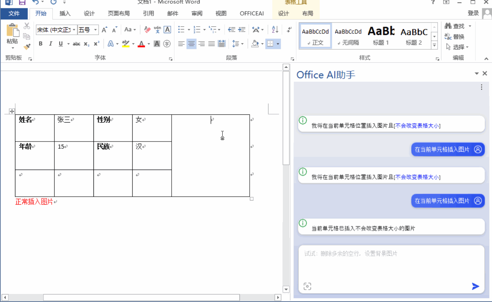
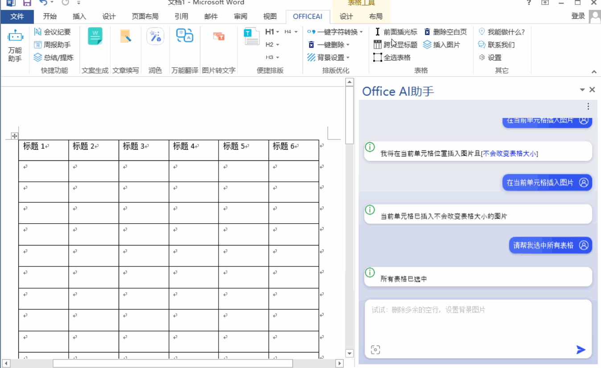

# OfficeAI

[English](/README_en.md) | [中文](/README_zh.md) 

     

## Feature Overview
OfficeAI Assistant is a plugin for Word that integrates AI capabilities into Microsoft Office. It solves problems like "How to input a check mark (✔)?" and "How to add text before inserting a table?" when Office features are too complex to navigate. With the AI Assistant, you simply tell it what you need, and AI automatically does it for you. Additionally, the assistant offers features like weekly report organization, meeting minutes, content summarization, and text polishing.

## Installation Environment
Windows 7/Windows 10/Windows 11 or higher + Office 2013/Office 2016/Office 2019/Office 365

# AI Writing and Polishing

Provides assistance in various types of copywriting, whether it's for marketing, technical documents, or internal communications. AI can enhance the quality of copywriting according to personalized requirements, ensuring each document meets your expected standards.
## Copywriting Generation
Capable of creating various types of articles. Whether you need to write marketing content, technical documents, or internal communication, this plugin handles it with ease.

## Weekly Report Organization
Quickly integrates your work results and data in an intelligent way to generate structured weekly reports. This feature allows you to easily understand work progress and conveniently share it with relevant teams or leaders. It significantly simplifies the process of creating weekly reports, saving you valuable time and effort.

## Article Polishing
Improves and optimizes articles according to your needs and preferences, enhancing their quality. Whether it's language expression, logical coherence, or content fluidity, the AI Assistant can adjust based on your guidance to better align the article with your expectations and style, ensuring a higher quality final draft.
## Meeting Minutes Generation
Automatically extracts important information from documents, intelligently identifying and summarizing key content to create structured meeting minutes. This feature greatly simplifies the process of writing meeting minutes, helping you quickly capture the main points and organize them into a readable and shareable format, making your meeting minutes clearer and more accurate.

## Article Continuation
Utilizes AI technology to understand the context of the text and provides new ideas, supplementary materials, or deeper insights for further content development. This feature makes document writing more efficient and comprehensive, helping you quickly expand and perfect the content.
## Language Translation
Supports translation between dozens of languages, including but not limited to English, Chinese, Japanese, Korean, and French. Whether you need to translate text into another language or from another language into your required language, this plugin provides fast and accurate translation services. This feature offers a convenient solution for cross-language communication, helping you handle multilingual texts more easily.
## Intelligent Interaction
You can interactively dialogue with the assistant, asking questions about document processing, seeking help or advice, acquiring information on specific topics, or clarifying doubts. This intelligent mode of interaction makes it more convenient to access needed information, quickly solve problems, and complete document processing tasks.
## Writing Suggestions
Whether in copywriting, content creation, or creative expression, the assistant offers targeted suggestions and tips through intelligent analysis and recommendations. This feature helps improve the quality of your copy, enhances content appeal, and even sparks creative inspiration, making you more effective in writing and creative endeavors.
## Image-to-Text Conversion
Recognizes text in images and outputs it to a Word document. With this feature, you can import images containing text into the document, and the assistant will automatically recognize the text in the images and accurately convert it into editable text, facilitating further editing or use in Word.

# Word Features

Easily accomplish various functions in Word through AI interaction, without the need to search for specific functions or remember complex VBA macro codes. This interactive operation provides a more intuitive and user-friendly interface, making task completion more convenient and efficient. Whether for beginners or experienced users, this intelligent usage experience makes document editing more enjoyable and efficient, saving a lot of time and effort.
## Punctuation One-Click Replacement
Quickly replaces English punctuation marks (e.g., ',.<>') in the document with Chinese punctuation marks (e.g., '，。《》'). This standardizes the copy in different contexts, improving the overall quality and readability of the document.

## Remove Blank Lines
Rapidly removes large sections of blank lines in the document, making the format clearer and neater. This feature allows you to eliminate unnecessary blank lines with one click, saving time and ensuring a more standardized document format.

## Set Background Color
Sets a specified background color for the current document. Through this function, you can choose the desired color and apply it to the background of the entire document. This action makes the document more personalized and visually appealing, making your document stand out and easier to distinguish.

## Set Background Image
Quickly set a background image for the document to enhance work efficiency.

## Select Entire Table
Solves the problem of incomplete manual selection when selecting an entire table in a Word document. With this feature, you can efficiently select all the contents of the required table, avoiding incomplete selections that might occur with manual operations, improving work efficiency and ensuring the accuracy of the entire table's selection.

## Insert Non-Distorting Images
Inserts images into the current cell of a table, adapting to the size of the cell, and solving the issue of tables expanding and affecting the appearance each time an image is inserted.

## Add Headers Across Pages
Adds titles to tables on each page. This operation ensures that each page of the table clearly presents title information, making the document more structured and readable, and facilitating user understanding of multi-page table content. This feature greatly enhances the overall organization and visual effect of the document, making tables clearer and more comprehensible when displayed across pages.

##  Delete Blank Pages
Easily removes extra blank pages caused by table formatting, keeping the document layout neat and enhancing readability while avoiding printing unnecessary blank pages.

## Insert Text Before Table
Enables the insertion of characters before a table, effectively solving the problem of being unable to directly add titles or descriptions before a table. This feature allows users to insert text, such as titles or descriptions, before tables, providing clearer context for the table content and enhancing document readability and structure. This operation simplifies editing content around the table, making it easier for users to manage the layout and structure of tables in the document.

## Remove Header Line
Quickly deletes the horizontal line in the header. This operation enables users to easily remove unwanted lines in the header, enhancing the overall appearance and professionalism of the document. This convenient editing feature saves users' time, making the page layout clearer and tidier, and ensuring the aesthetic and consistency of the document's appearance.

# Others
## Contact Us

## 功能简介
OfficeAI助手是Word的插件，它将AI功能集成到Microsoft Office 中。它帮解决"打勾（√）符号怎么输入?"、"怎么在插入表格前添加文字?"Office功能太复杂不知道哪里找的问题。在AI助手中您只需要告诉助手你要做什么，AI自动帮您完成，同时AI助手具备周报整理、会议纪要，内容总结、润色等功能。

## 安装环境
win7/win10/win11或更高 + Office2013/Office2016/Office2019/Office 365

# AI创作润色

能够在多种文案类型中助您一臂之力，无论是市场营销、技术文档还是内部沟通，都能轻松应对。AI 能够根据个性化需求，有效提升文案质量，确保每篇文档都达到您的预期水准。
## 文案生成
具备创作多种类型的文章的能力。无论您需要编写市场营销文案、技术文档还是内部沟通内容，这款插件都能轻松胜任。

## 周报整理
通过智能化的方式，快速整合您的工作成果和数据，生成结构化的周报，让您轻松了解工作进展，并能够便捷地分享给相关团队或领导。这项功能大大简化了周报制作的流程，为您节省宝贵的时间和精力。

## 文章润色
根据您的需求和偏好，对文章进行改善和优化，以提升其质量。无论是在语言表达、逻辑连贯性还是内容流畅度方面，AI 助手能够根据您的指导进行调整，使得文章更符合您的期望和风格，确保最终产出的文稿质量更高。
## 纪要生成
自动提取文档重要信息的能力，能够智能地从文档中识别并提取关键内容，然后生成结构化的会议纪要。这项功能大大简化了会议纪要的撰写过程，帮助您快速捕捉会议中的要点，并将其整理成易于阅读和分享的格式，让您的会议纪要更加清晰、准确。

## 文章续写
通过 AI 技术，它能够理解文本的语境，并在您需要进一步发展内容时，为您提供新的想法、补充资料或更深层次的见解，从而丰富文档内容。这项功能使得文稿编写更为高效和全面，帮助您更快地完成内容的拓展和完善。
## 语言翻译
支持几十种语言之间的互译，包括但不限于英语、中文、日语、韩语和法语等。无论您需要将文本翻译成其他语言或将其他语言翻译成您需要的语言，这款插件都能够提供快速准确的翻译服务。这项功能为跨语言交流提供了便捷地解决方案，帮助您更轻松地处理多语言文本。
## 智能互动
您可以与助手进行交互式对话，询问有关文档处理的问题，寻求帮助或建议，获取特定主题的信息或解答疑惑。这种智能交互方式让您更便捷地获取所需信息，快速解决问题，并完成文档处理任务。
## 写作建议
无论是在文案写作、内容创作还是创意表达方面，助手可以通过智能分析和推荐，为您提供针对性的建议和提示。这项功能可以帮助您改善文案质量、提升内容吸引力，甚至激发创作灵感，让您在写作和创意方面更具成效。
## 图转文字
识别图片中的文字并将其输出到 Word 文档中。通过这项功能，您可以将包含文字的图片导入到文档中，助手会自动识别图片中的文字内容，并将其准确地转换成可编辑的文本，方便您在 Word 中进一步编辑或使用。

# Word功能

通过与 AI 互动，轻松完成 Word 中的各项功能，无需费力搜索特定功能的位置，也不必记忆复杂的 VBA 宏代码。这种交互式操作为用户提供了更直观、更友好的界面，使得完成各项任务变得更加便捷和高效。无论是对于初学者还是经验丰富的用户，这种智能化的使用体验都让文档编辑更加愉快和高效，节省了大量的时间和精力。
## 标点一键替换
快速将文档中的英文标点符号（例如：',.<>'）替换为中文标点符号（例如：'，。《》'）。这使得文案在不同语境下更加规范和统一，提高了文档的整体质量和可读性。

## 删除全文空行
快速删除文档中产生的大段空行，使得文档格式更加清晰整洁。这项功能让您能够一键去除多余的空行，节省时间并确保文档呈现更为规范的格式。

## 设置背景颜色
为当前文档设置指定的背景颜色。通过这个功能，您可以选择所需的颜色，然后将其应用到整个文档的背景中。这样的操作能够使文档更具个性化和视觉吸引力，让您的文档更加突出和易于区分。
## 设置背景图片
快捷的给文档设置背景图片，以提升工作效率
## 全选表格
利用特定功能解决了在 Word 文档中全选表格时手动操作无法完全选中的问题。通过这一功能，您可以高效地全选所需表格内容，避免了手工操作可能出现的选择不完整的情况，提升了工作效率并确保了整个表格的选取准确性。

## 插入不变形图片
向表格当前单元格插入图片，适应单元格大小的图片，解决每次插入图片时导致表格拉大，影响外观的问题。

## 跨页添加表头
为每一页的表格添加标题。这一操作使得每个表格页面都能清晰地呈现标题信息，让文档更具结构性和可读性，方便用户阅读和理解多页表格内容。这项功能极大地提升了文档的整体组织和可视化效果，使得表格在分页显示时更为清晰明了。

## 删除空白页
轻松移除因表格排版而产生的多余空白页，保持文档排版整洁，提升文档可读性,同时避免多打印出空白的页
## 表格前输入
在表格前插入字符的功能，有效解决了无法直接在表格前添加标题或描述的问题。这项功能允许用户在表格前插入文字，比如标题或描述，为表格内容提供更清晰的上下文，增强文档可读性和结构性。这种操作简化了对表格周围内容的编辑，使得用户能够更轻松地管理文档中的表格排版和结构。
## 去除页眉横线
快速删除页眉中的横线。这项操作使用户能够轻松去除页眉中不需要的横线，提升文档整体外观和专业性。这种便捷的编辑功能节省了用户的时间，让页面布局更为清晰和整洁，确保了文档外观的美观性和一致性。

# 其它

## 联系我们

