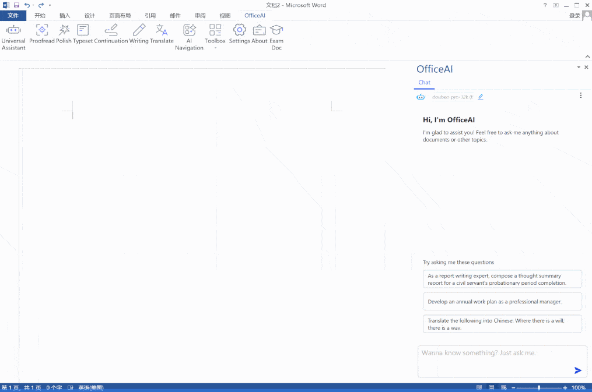
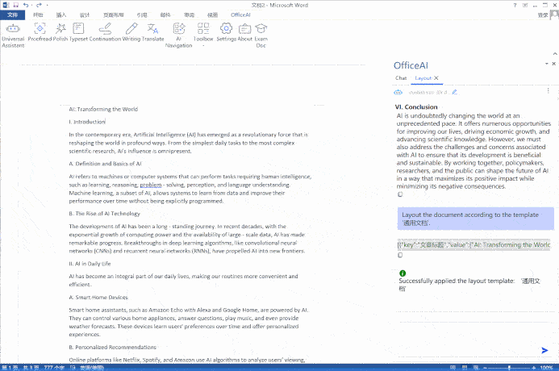
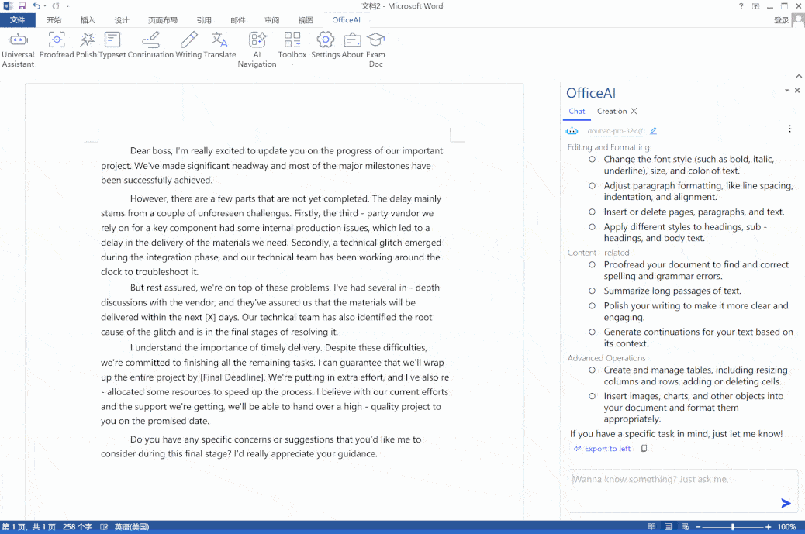
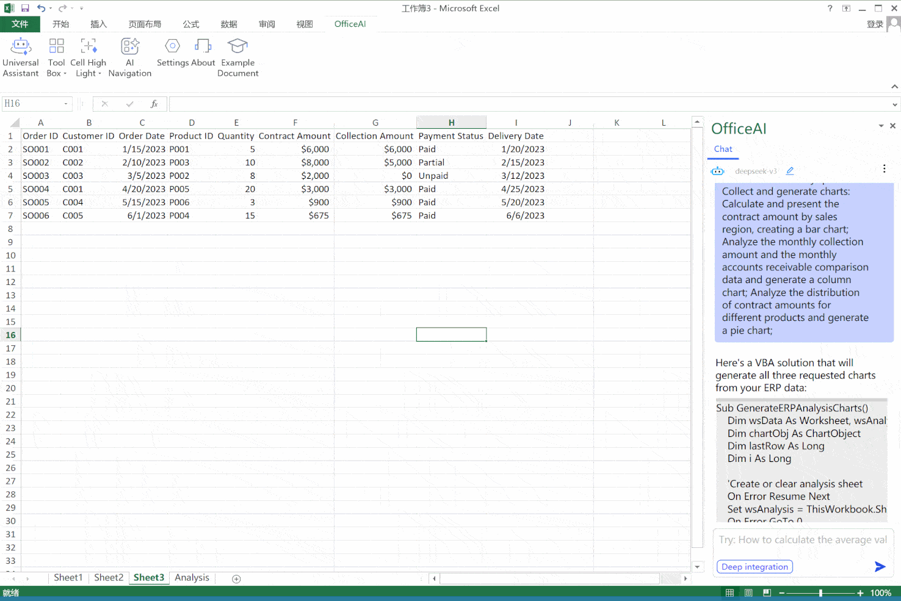
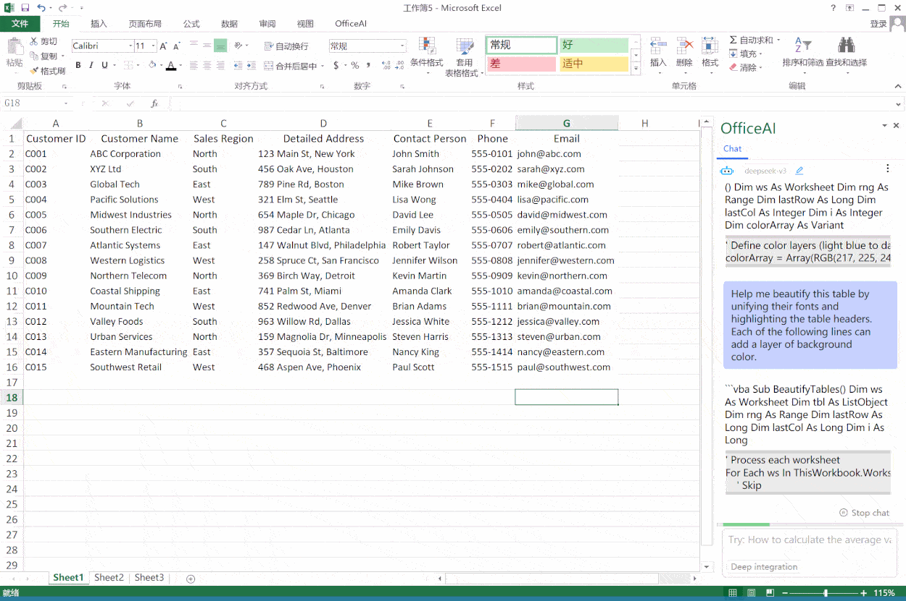
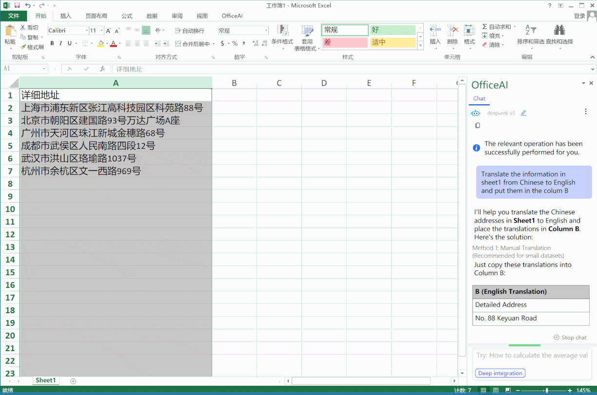

# 🚀 OfficeAI

> OfficeAI 是一款集成于 Microsoft Office 和 WPS 的 AI 助手插件，让你在 Word 和 Excel 中无缝调用大语言模型进行写作、润色、翻译、排版、数据分析等操作。  
> 在 Word 中，你可直接在右侧面板与 AI 对话并一键将结果插入文档；在 Excel 中，仅需自然语言命令即可自动处理复杂函数与图表生成。  
> **现阶段提供免费额度使用，轻量上手、即装即用，大幅提升办公效率。**

 

**README多语言版本**：[English](/README.md) | [中文](/README_zh.md)

---

## 📚 目录

- [关于 OfficeAI](#关于-officeai)  
- [核心功能](#核心功能)  
  - [Word AI 📝](#word-ai-)  
  - [Excel AI 📊](#excel-ai-)  
- [支持的大语言模型](#支持的大语言模型)  
- [安装说明](#安装说明)  
- [使用指南](#使用指南)  
- [相关资源](#相关资源)  
- [优化计划](#优化计划)  
- [贡献指南](#贡献指南)  
- [联系我们](#联系我们)

---

## 关于 OfficeAI

OfficeAI 作为插件无缝集成到 Microsoft Office 和 WPS 中，支持智能文档和电子表格处理。**Word AI** 提供AI聊天、写作、润色、校对、智能排版、翻译等功能，让文档创作更高效；**Excel AI** 提供AI对话、公式生成、数据分析、图表可视化等功能，让数据处理更智能。你只需用自然语言，就能生成内容、分析数据等功能——**无需公式，无需模板**。

---

## 核心功能

### Word AI 📝
（Word AI是OfficeAI的亮点功能）

OfficeAI 在 Word/WPS 插件中提供一整套高效且在办公场景常见的AI功能：

#### 💬 **AI 对话与写作**
- **与AI大模型自然对话**：在Word/WPS中与 AI 进行免费的自由对话，你可与热门大模型进行多轮对话。AI的回复结果可以一键导出到文档中，也可以复制到剪贴板
- **AI 写作**：你可自定义提示词并保存为「常用模式」，在任意文档中一键调用，完成自动续写、摘要提取、语言转换等任务，支持营销文案、技术文档、内部沟通等多种类型文章创作。
- **AI 导航**：在 Word/WPS 中快速唤起 ChatGPT、Claude、Gemini 等热门模型对话入口，**无需切换窗口**，即点即用！

  **对话与写作界面展示**
  

#### 🎨 **智能排版与格式**
- **一键排版**：一键应用专业排版格式。内置多种模板，支持自定义编辑，用户可进行高效的一键排版任务，并可通过自然语言对话实时调整效果，自动生成大纲目录。同时用户也可创建自定义模板，并进行一键排版
- **排版模板调整**：支持模板复制、编辑、自定义，可设置大纲级别、西文字体等高级格式

  **智能排版与格式界面展示**
  

#### ✍️ **文档优化与处理**
- **校对 / 润色**：选择文本内容（或全文档），Office AI能突破大模型上下文长度限制，支持长文校对。AI 自动查找并修正错别字、语法错误等
- **AI 续写**：选择文本内容，AI 智能续写文章，结果以蓝色字体显示，可确认应用或撤销
- **AI 翻译**：支持多种语言互译，内置翻译模式，也可自定义翻译模式。

  **文档优化与处理界面展示**
  

#### 🛠️ **工具箱功能**
- **AI 会议纪要**：基于文档内容自动生成专业会议纪要格式
- **AI 总结提炼**：快速提取文档关键内容，节省阅读时间
- **周报助手**：快速整理周报关键信息为标准格式
- **一键删除**：删除多余空行、清除格式、移除超链接等
- **表格处理**：表格前插入内容、跨页显示表头、全表选择等
- **图像转文字**：识别图片中的文字并转换为可编辑文本

更多详细：[WordAI 详细文档](https://github.com/office-sec/OfficeAI/wiki/3-WordAI-Plugin)

---

## Excel AI 📊

OfficeAI 在 Excel/WPS 插件中提供一整套高效且在办公场景常见的AI功能：

#### 💬 **AI 对话与数据分析**
- **与 Excel 对话**：直接对话生成数据分析
- **智能命令执行**：无需公式，轻松处理复杂指令

  **AI 对话与数据分析界面展示**
  

#### 📊 **数据分析与可视化**
- **数据可视化**：自动生成各类图表和可视化视图
- **企业级隐私**：本地运行，保障数据安全
- **数据清洗**：表格数据一键清洗和优化

  **数据可视化功能展示**
  

#### 🎯 **核心数据处理功能**
- **公式通道**：自然语言询问，AI自动生成公式
- **跨表处理**：跨工作表数据处理和分析
- **批量计算**：支持加减乘除等批量运算
- **数据提取**：一键提取或过滤各类数据
- **智能统计**：求和、平均值、最大值、最小值等

  **跨表处理功能展示**
  

#### 🎨 **格式与样式处理**
- **数字格式转换**：中文数字、大写数字、文本格式等
- **金额格式处理**：大写金额、万为单位、千分位分隔符
- **单元格高亮**：智能高亮，可自定义效果
- **快速格式化**：万为单位、货币符号、中文数字等

  **格式与样式处理界面展示**
  

#### 🛠️ **工具箱功能**
- **快速输入**：性别、勾选/叉号、是/否等，支持下拉框
- **四舍五入**：向上取整、向下取整、取偶等
- **姓名处理**：修改、对齐、提取姓名
- **身份证处理**：屏蔽信息、提取出生日期、年龄、性别
- **电话号码**：屏蔽、分段显示、随机生成
- **表格翻译**：支持多语言表格内容翻译，一键转换语言

  **翻译功能展示**
  

更多详细：[ExcelAI 详细文档](https://github.com/office-sec/OfficeAI/wiki/4-ExcelAI-Plugin#432-extractfilter)

---

## 支持的大语言模型

支持连接多种大语言模型，包括：
- 🤖 Claude / Gemini / DeepSeek / OpenRouter 
用户可自由配置 API Key 进行灵活接入。

---

## 安装说明

**系统要求**：Windows 7/10/11 或更高版本 + Office 2013/2016/2019/Office 365

1. ⬇️ 下载插件安装包：[立即安装](https://office-ai.net)  
2. 📦 解压并双击运行安装程序  
3. 🧑‍💻 打开 Word 或 Excel 或WPS，插件将自动加载  
4. ✨ 插件入口位于顶部工具栏，点击开始智能办公之旅！

---

## 使用指南

请参考完整使用教程 👉 [https://github.com/office-sec/OfficeAI/wiki]

📌 **提示**：插件右侧浮窗支持持续对话，可嵌入本地内容上下文

---

## 相关资源

- 📄 [产品官网](https://office-ai.net)  
- 📚 [GitHub Wiki 详细文档](https://github.com/office-sec/OfficeAI/wiki)

---

## 优化计划

- 🔌 支持 macOS 版本  
- 📚 长文本润色、翻译等长文本互动  
- 🎨 AI智能排版：自动分析文档格式并生成自定义模板
- 🧙‍♂️ 更强上下文理解能力  
- ✨ 支持更多的语言  
- 🤖 更方便的插件内 API Key 绑定与操作  
- 📊 Excel功能增强与优化

---

## 贡献指南

欢迎任何形式的贡献！包括但不限于：

- 🐛 Bug 报告  
- ✨ 新功能建议  
- 🧑‍💻 PR 提交  
- 📖 使用文档补充  

---

## 联系我们

- 🌐 官网: [https://office-ai.net](https://office-ai.net)    
- 📧 邮箱: service@office-ai.net

